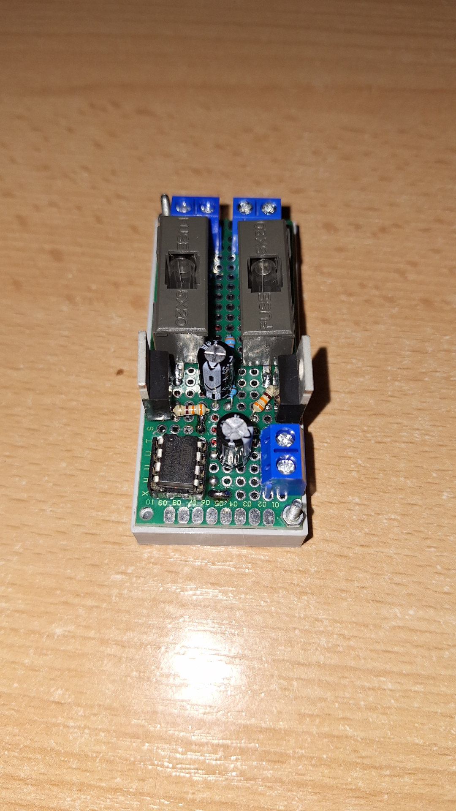
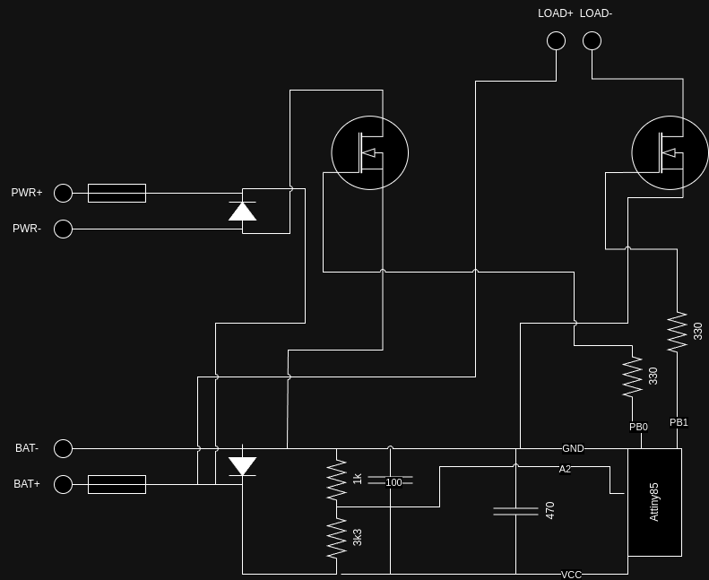
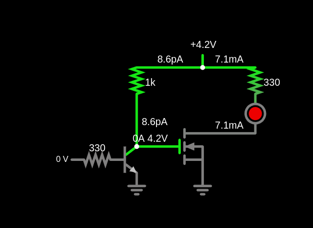
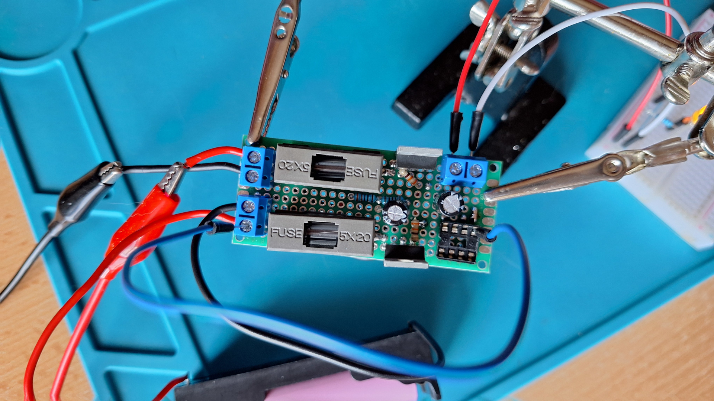
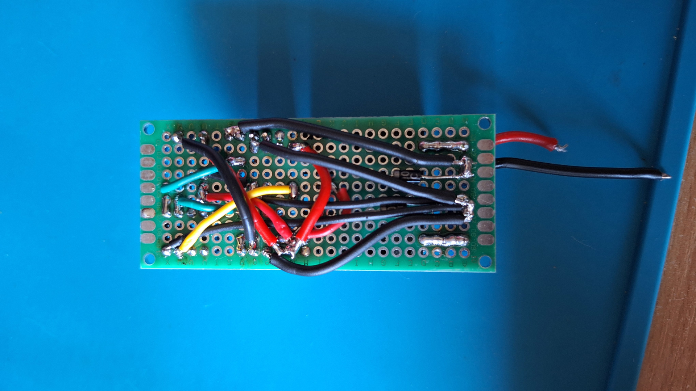

# SBPS
Simple Battery Protection System

### Motivation
As I discussed [here](https://github.com/zNitche/attiny-voltmeter), I wanted to build
my own simple bms with configurable cutoff voltages.

### Circuit
After some research I came up with following circuit,
allowing low voltage cutoff + overvoltage protection (cut charging when battery voltage is above specified threshold).
It is designed to work with 1S lipol batteries (max allowed voltage is around 5.5V).

Applying this circuit to for example 12v battery will require following modifications:
- Adding step-down converter to power attiny with (5v should be good).
- Changing voltage divider ratio to measure higher voltage.
- I haven't tested it yet, but as far as I know ADC reference voltage should be changed to 5V (if you power AtTiny the way I mentioned above). 

Circuit draws around 1.5mA at 4V

#### What can be modified
I wanted to add following circuit to reverse the way charging (PWR) Mosfet is controlled (H for disabled, L for enabled).

To achieve it all what is needed is NPN transistor + 1 extra resistor, but because of lacking space on my board (around 2cm x 2cm for all components + wiring)
I decided against adding it.

### Testing
After wiring everything up I hooked it to Lab PSU and battery, got my multimeter and tested if everything works as it should.

luckily it was, because if it wasn't it would probably need rewiring (while ready wiring looks like this, yup it would be so much fun)

### Uploading code
In order to upload code to Attiny I used USBasp ISP programmer and Arduino IDE 2.3.2.

### BMS controller
Attiny85 was used as BMS controller, to archive it i modified my code from [here](https://github.com/zNitche/attiny-voltmeter),
added controlling mosfets instead of leds + implemented what I called software hysteresis.

It works quite straightforward if voltage drops below certain threshold, load is cut off, then voltage needs to rise
above this threshold + hysteresis voltage, this condition needs to be fulfilled to load be enabled again.

### Summary
I took a some time (especially wiring) but after all device is ready and can be used in my further projects.